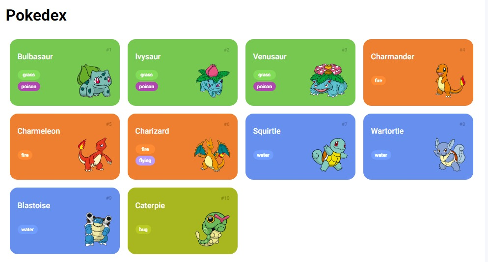
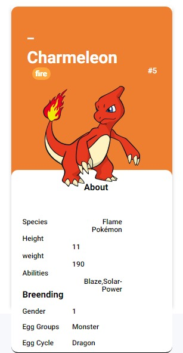
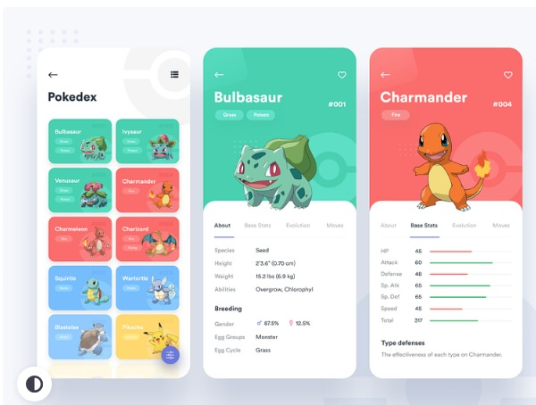

# Olá, eu sou o Jeffesron Napomuceno! 👋

## 🚀 Sobre mim
Este projeto contém um pouco do que estou estudando em Andela, no Bootcamp do Santander, realizado pela equipe [DIO!](https://web.dio.me/track/bf7abb82-1324-4074-9949-f474a1a911fe).

Estou gostando do que estou vendo e espero que você também goste do resultado do projeto.

# Projeto Pokedex

## 🛠 Habilidades
o intuido desse projeto envolve o estudo de 
Javascript, HTML, CSS, node.js e introdução a utilziação de API via Javascript.

## Stack utilizada
**Back-end:** Node

## Versão do Projeto V1.0.1

Esta é a versão atual do projeto, mas a ideia é sempre melhorando e atualizando
## Imagens do Projeto atual

## Referência

A ideia base para realizar o projeto
 - [dribbble](https://dribbble.com/shots/6540871-Pokedex-App)

